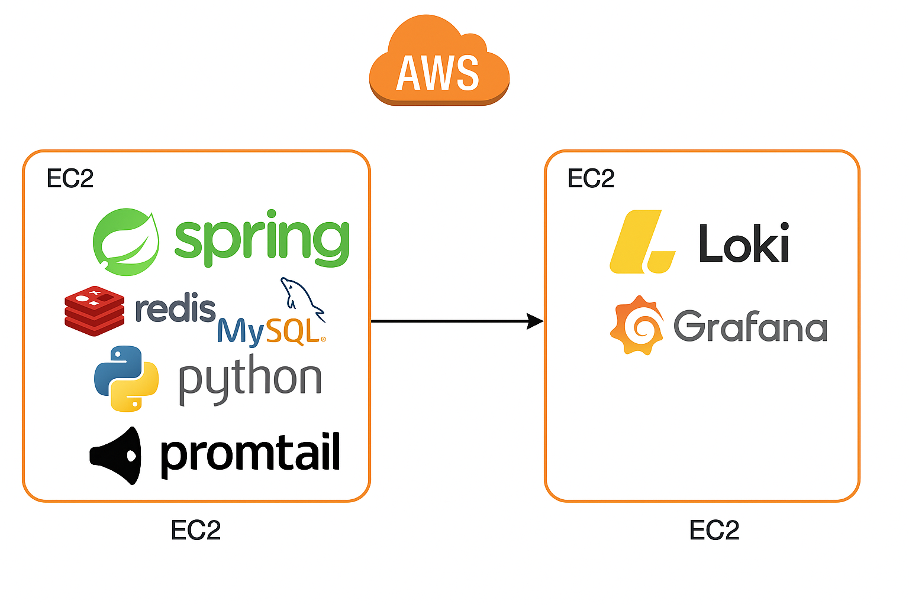

# 🎬 Movie Preview Alarm

이 프로젝트는 영화 시사회 및 무대 인사 정보를 수집하여, 사용자에게 이메일로 알림을 전송하는 시스템입니다.

## 🔹 프로젝트 버전

이 프로젝트는 두 가지 버전으로 구성되어 있습니다.

- **v0**: 단일 Python 기반의 초기 버전
- **v2**: Python 크롤러 + Spring Boot 서버 기반의 버전

## 🚀 실행 방법

각 버전의 실행 방법은 해당 폴더의 `README.md` 파일을 참고하세요.

- **v0 실행 방법** → [`./v0/README.md`](./v0/README.md)
- **v2 실행 방법** → [`./v2/README.md`](./v2/README.md)

## ☁️ 배포 구조

 서비스는 AWS EC2 인스턴스 두 개에 Docker Compose 기반으로 배포되어 있습니다.

  

- **EC2-1**:  
  - `Python` 크롤러  
  - `Spring Boot` 서버  
  - `Redis`, `MySQL`  
  - `Promtail` (로그 수집기)
  
- **EC2-2**:  
  - `Loki` (로그 저장 및 검색)  
  - `Grafana` (로그 시각화 및 알림)

### 🔁 로그 흐름 요약
- `Promtail`이 Docker 및 크롤러 로그를 수집해 `Loki`로 전송
- `Grafana`에서 `Loki` 로그를 시각화하고 알림 조건을 설정해 오류 발생 시 이메일로 전송