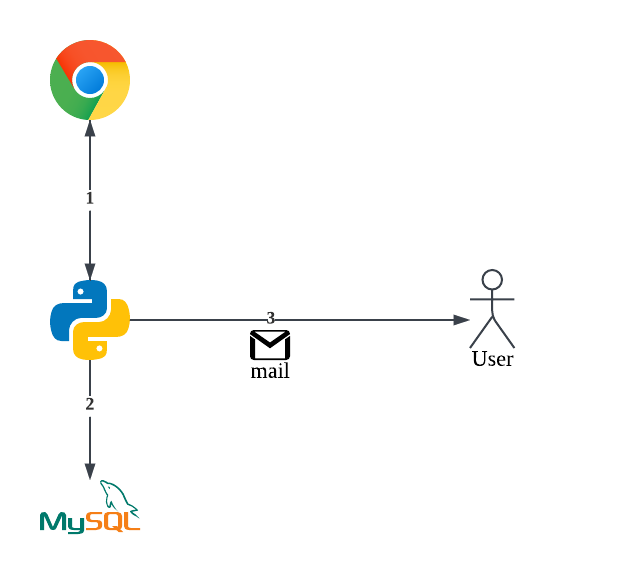
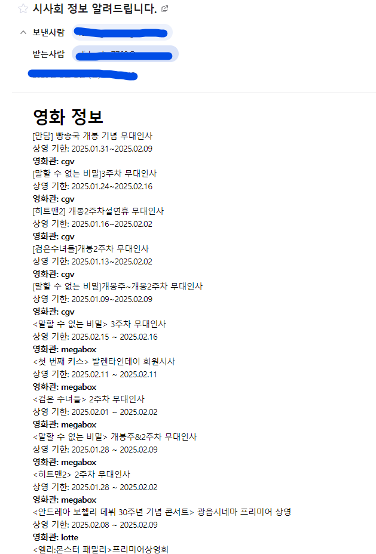

# 🎬 Movie Preview Alarm - v0

이 프로젝트는 영화 시사회/무대 인사 알림을 제공하는 시스템입니다. v0 버전은 Python으로만 구현되었습니다.

## 🔧 필수 조건

- Python 3.11 이상

## 🛠️ 실행 방법

1. **가상 환경 만들기**  
   프로젝트 폴더에서 가상 환경을 만듭니다.

   ```bash
   python3 -m venv .venv
   ```

2. **가상 환경 활성화**  
   - **Windows**:
     ```bash
     .\.venv\Scripts\activate
     ```
   - **macOS/Linux**:
     ```bash
     source .venv/bin/activate
     ```

3. **필요한 패키지 설치**  
   `requirements.txt`에 정의된 의존성 패키지를 설치합니다.

   ```bash
   (.venv) pip install -r requirements.txt
   ```

4. **환경 변수 설정**  
   프로젝트 루트에 `.env` 파일을 생성하고 필요한 설정을 추가합니다. 
 
    필요한 값은 다음과 같은 3개의 값입니다.

   ```env
    # 이메일 보내는 사람의 이메일 주소
   SENDER_EMAIL=your_email@example.com

   # 이메일 인증을 위한 키 (이메일 서비스에서 발급받을 수 있음)
   SENDER_KEY=your_sender_key
   
   # 알림을 받을 사람의 이메일 주소
   RECEIVER_EMAIL=receiver_email@example.com
   ```

5. **프로그램 실행**  
   실행 명령어를 입력하여 시스템을 시작합니다.

   ```bash
   (.venv) python main.py
   ```

## 🔄 Workflow
기본적인 workflow 그림은 다음과 같습니다.

<p align="center">
  
</p>

### 📋 순서 설명

1. **영화 사이트 시사회 창에서 웹 크롤링**  
   각 영화 사이트에서 시사회 정보를 크롤링합니다. 이 단계에서는 영화 시사회 제목, 일정 등의 데이터를 자동으로 수집합니다.


2. **크롤링한 데이터를 MySQL에 저장**  
   크롤링한 데이터를 MySQL 데이터베이스에 저장합니다. 데이터를 `movie_curtain_call_info` 테이블에 넣어 관리합니다.


3. **사용자에게 이메일로 전송**  
   수집한 영화 시사회 데이터를 기반으로 사용자가 설정한 시간에 이메일 알림을 발송합니다. 이메일에는 해당 시사회 정보가 포함됩니다.


## 📊 실행 결과

코드를 실행시키면 다음과 같이 이메일을 전송받게 됩니다.

<p align="center">
  
</p>