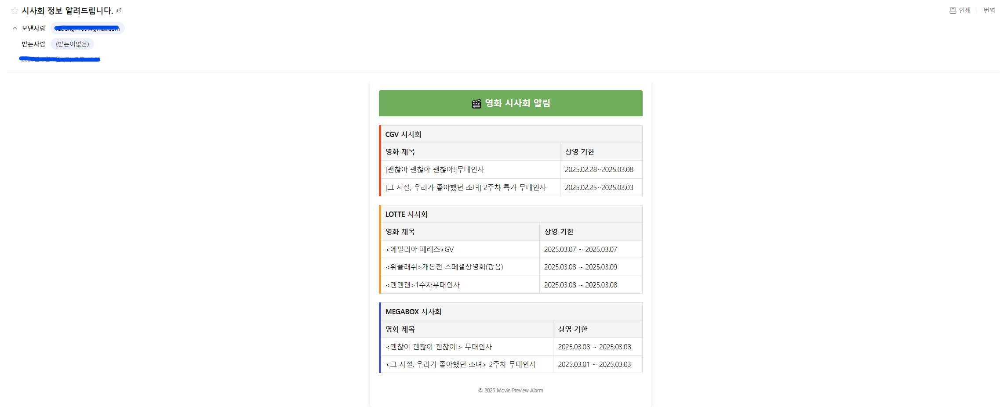

# 🎬 Movie Preview Alarm - v2

이 프로젝트는 영화 시사회/무대 인사 알림을 제공하는 시스템입니다.  
v2 버전은 Python과 Spring Boot를 함께 사용하여 구현되었습니다.  
해당 버전은 Redis와 MySQL을 필수로 사용하며, 로컬에서 실행하거나 Docker를 통해 실행할 수 있습니다.

## 🔧 필수 조건

- Python 3.11 이상
- Java 17 이상
- Redis 7.4
- MySQL 8.0.x

## 🛠️ 실행 방법

이 프로젝트는 **로컬 실행**과 **Docker 실행** 방식으로 실행할 수 있습니다.  
각 방식에 대한 설명은 아래에 나와 있습니다.

### 1. 로컬에서 실행하는 방법

#### 1-1. **Python 환경 설정**

0. **실행하기 전 조건**
- `redis`, `mysql`이 local 환경에서 실행되고 있어야한다.

1. **가상 환경 만들기**  
   프로젝트 폴더에서 가상 환경을 만듭니다.

   ```bash
   python3 -m venv .venv
   ```

2. **가상 환경 활성화**  
   - **Windows**에서:
   ```bash
   .\.venv\Scripts\activate
   ```
   - **macOS/Linux**에서:
     ```bash
     source .venv/bin/activate
     ```

3. **필요한 패키지 설치**  
   `requirements.txt`에 정의된 의존성 패키지를 설치합니다.

   ```bash
   (.venv) pip install -r requirements.txt
   ```

4. **환경 변수 설정**  
   - **spring boot**에서:
   
      `./spring/src/main/resources/application.properties` 에 있는 설정 값을 채워넣으면 된다.
   - **python**에서 

      `./.env` 에 있는 설정 값을 채워넣으면 된다.

5. **Python 프로그램 실행**  
   Python 서비스를 실행하여 알림 시스템을 시작합니다.

#### 1-2. **Spring Boot 환경 설정**

1. **gradle 의존성 설치**  
   `build.gradle` 파일을 이용해 필요한 의존성 라이브러리를 설치합니다.

2. **Spring Boot 애플리케이션 실행**  
   Spring Boot 애플리케이션을 실행합니다.

### 2. Docker로 실행하는 방법

Docker가 설치되었다는 가정 하에 실행합니다.

1. **환경 변수 설정**  
   `.env` 파일에 있는 환경 변수 값들을 설정합니다.

2. **Docker 컨테이너 실행**  
   Redis, MySQL, python, spring boot를 포함한 컨테이너를 실행합니다.

   ```bash
   docker-compose up -d
   ```
3. **※ 데이터 크롤링 주기 변경하는 방법**  
    현재 데이터 크롤링 주기는 오전 9시, 오후 4시로 설정 되어있습니다.  
    `./web_crawling/cron.sh` 를 수정하면 원하는 시간으로 변경 가능합니다.


## 🔄 Workflow

<p align="center">
  
</p>

### 📋 순서 설명

1. **영화 사이트 시사회 창에서 웹 크롤링**  
   각 영화 사이트에서 시사회 정보를 크롤링합니다. 이 단계에서는 영화 시사회 제목, 일정 등의 데이터를 자동으로 수집합니다.

2. **크롤링한 데이터를 Redis에 전송**  
   크롤링한 데이터를 Python에서 가공을 한 후 redis로 전송합니다.

3. **Redis로부터 데이터 수신**  
   Redis가 특정 topic을 구독하고 있는 spring boot로 데이터를 push합니다.

4. **사용자에게 이메일로 전송**  
   수집한 영화 시사회 데이터를 기반으로 사용자가 설정한 시간에 이메일 알림을 발송합니다. 이메일에는 해당 시사회 정보가 포함됩니다.

5. **데이터를 MySQL에 저장**  
    데이터를 MySQL 데이터베이스에 저장합니다. 데이터를 `movie_curtain_call_info` 테이블에 넣어 관리합니다.

## 📊 실행 결과

코드를 실행시키면 다음과 같이 이메일을 전송받게 됩니다.

<p align="center">
  
</p>